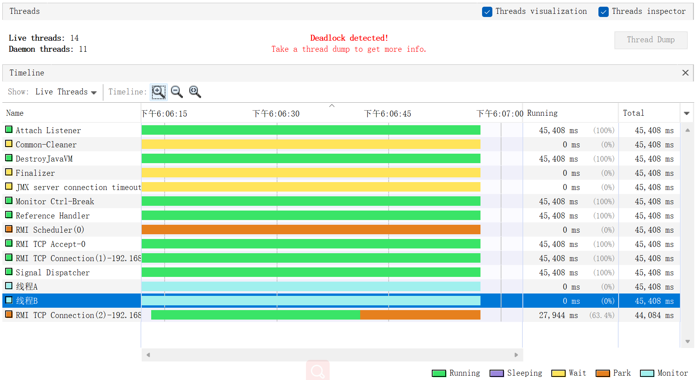

```shell

2021-10-17 18:06:34

"线程A" - Thread t@14
   java.lang.Thread.State: BLOCKED
	at app//org.kayla.concurrency.conc0302.lock.Count3.add(Count3.java:24)
	- waiting to lock <6723abad> (a [B) owned by "线程B" t@15
	- locked <70eab7a3> (a [B)
	at app//org.kayla.concurrency.conc0302.lock.ThreadA.run(ThreadA.java:18)

   Locked ownable synchronizers:
	- None

"线程B" - Thread t@15
   java.lang.Thread.State: BLOCKED
	at app//org.kayla.concurrency.conc0302.lock.Count3.lockMethod(Count3.java:38)
	- waiting to lock <70eab7a3> (a [B) owned by "线程A" t@14
	- locked <6723abad> (a [B)
	at app//org.kayla.concurrency.conc0302.lock.ThreadB.run(ThreadB.java:17)

   Locked ownable synchronizers:
	- None


```