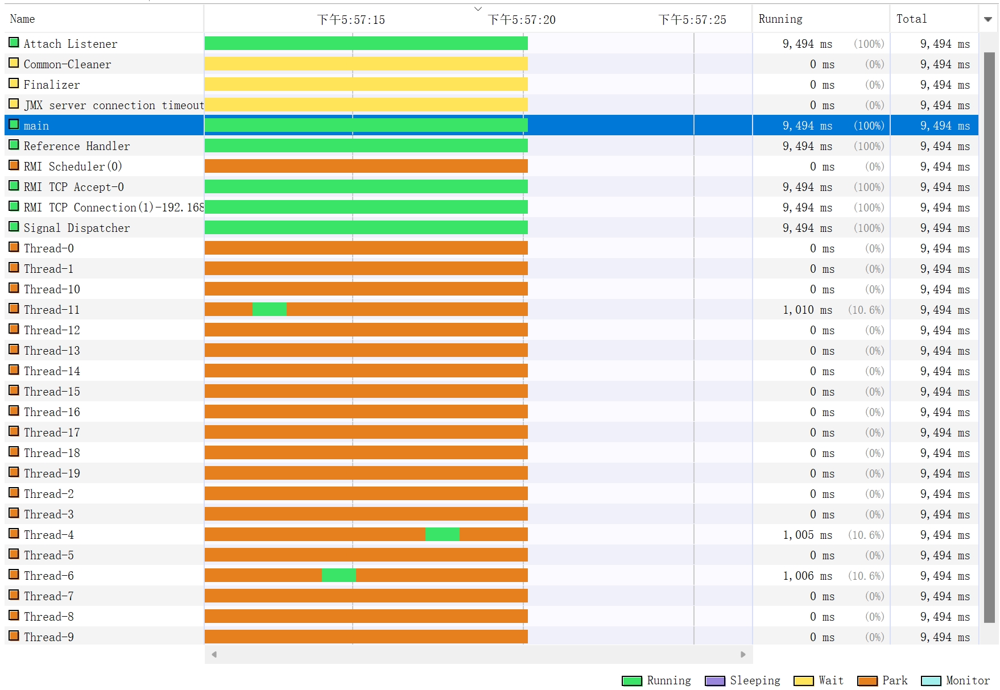

```shell

2021-10-17 17:57:17

"Thread-0" - Thread t@16
   java.lang.Thread.State: WAITING
	at java.base@12.0.2/jdk.internal.misc.Unsafe.park(Native Method)
	- parking to wait for <4510caca> (a java.util.concurrent.locks.ReentrantLock$FairSync)
	at java.base@12.0.2/java.util.concurrent.locks.LockSupport.park(LockSupport.java:194)
	at java.base@12.0.2/java.util.concurrent.locks.AbstractQueuedSynchronizer.parkAndCheckInterrupt(AbstractQueuedSynchronizer.java:885)
	at java.base@12.0.2/java.util.concurrent.locks.AbstractQueuedSynchronizer.acquireQueued(AbstractQueuedSynchronizer.java:917)
	at java.base@12.0.2/java.util.concurrent.locks.AbstractQueuedSynchronizer.acquire(AbstractQueuedSynchronizer.java:1240)
	at java.base@12.0.2/java.util.concurrent.locks.ReentrantLock.lock(ReentrantLock.java:267)
	at app//org.kayla.concurrency.conc0302.lock.TestFair.increase(TestFair.java:19)
	at app//org.kayla.concurrency.conc0302.lock.TestFair.lambda$main$0(TestFair.java:37)
	at app//org.kayla.concurrency.conc0302.lock.TestFair$$Lambda$1/0x00000008011f0840.run(Unknown Source)
	at java.base@12.0.2/java.lang.Thread.run(Thread.java:835)

   Locked ownable synchronizers:
	- None

"Thread-1" - Thread t@17
   java.lang.Thread.State: WAITING
	at java.base@12.0.2/jdk.internal.misc.Unsafe.park(Native Method)
	- parking to wait for <4510caca> (a java.util.concurrent.locks.ReentrantLock$FairSync)
	at java.base@12.0.2/java.util.concurrent.locks.LockSupport.park(LockSupport.java:194)
	at java.base@12.0.2/java.util.concurrent.locks.AbstractQueuedSynchronizer.parkAndCheckInterrupt(AbstractQueuedSynchronizer.java:885)
	at java.base@12.0.2/java.util.concurrent.locks.AbstractQueuedSynchronizer.acquireQueued(AbstractQueuedSynchronizer.java:917)
	at java.base@12.0.2/java.util.concurrent.locks.AbstractQueuedSynchronizer.acquire(AbstractQueuedSynchronizer.java:1240)
	at java.base@12.0.2/java.util.concurrent.locks.ReentrantLock.lock(ReentrantLock.java:267)
	at app//org.kayla.concurrency.conc0302.lock.TestFair.increase(TestFair.java:19)
	at app//org.kayla.concurrency.conc0302.lock.TestFair.lambda$main$0(TestFair.java:37)
	at app//org.kayla.concurrency.conc0302.lock.TestFair$$Lambda$1/0x00000008011f0840.run(Unknown Source)
	at java.base@12.0.2/java.lang.Thread.run(Thread.java:835)

   Locked ownable synchronizers:
	- None


```