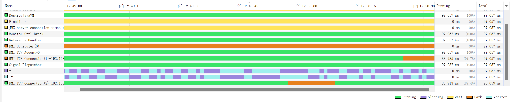
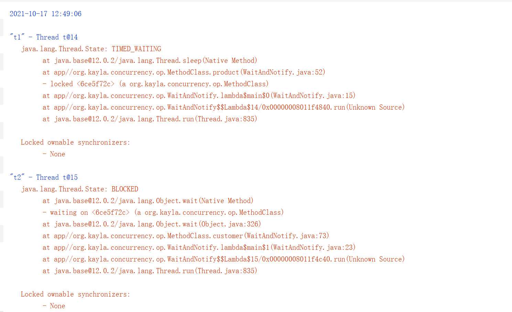

```shell
2021-10-17 12:50:29
Full thread dump Java HotSpot(TM) 64-Bit Server VM (12.0.2+10 mixed mode, sharing):

Threads class SMR info:
_java_thread_list=0x000001da77ff7da0, length=18, elements={
0x000001da770c3000, 0x000001da770c6000, 0x000001da770e1800, 0x000001da770e2800,
0x000001da770e3800, 0x000001da770e7000, 0x000001da770e8000, 0x000001da770aa000,
0x000001da77b85000, 0x000001da77c3b800, 0x000001da77c45800, 0x000001da77c46000,
0x000001da5651a800, 0x000001da77df9800, 0x000001da77e33000, 0x000001da77e29800,
0x000001da77e47000, 0x000001da77e92000
}

"Reference Handler" #2 daemon prio=10 os_prio=2 cpu=0.00ms elapsed=97.45s tid=0x000001da770c3000 nid=0x3e18 waiting on condition  [0x000000a8629ff000]
   java.lang.Thread.State: RUNNABLE
        at java.lang.ref.Reference.waitForReferencePendingList(java.base@12.0.2/Native Method)
        at java.lang.ref.Reference.processPendingReferences(java.base@12.0.2/Reference.java:241)
        at java.lang.ref.Reference$ReferenceHandler.run(java.base@12.0.2/Reference.java:213)

   Locked ownable synchronizers:
        - None

"Finalizer" #3 daemon prio=8 os_prio=1 cpu=0.00ms elapsed=97.45s tid=0x000001da770c6000 nid=0x29e8 in Object.wait()  [0x000000a862aff000]
   java.lang.Thread.State: WAITING (on object monitor)
        at java.lang.Object.wait(java.base@12.0.2/Native Method)
        - waiting on <0x0000000088b04170> (a java.lang.ref.ReferenceQueue$Lock)
        at java.lang.ref.ReferenceQueue.remove(java.base@12.0.2/ReferenceQueue.java:155)
        - locked <0x0000000088b04170> (a java.lang.ref.ReferenceQueue$Lock)
        at java.lang.ref.ReferenceQueue.remove(java.base@12.0.2/ReferenceQueue.java:176)
        at java.lang.ref.Finalizer$FinalizerThread.run(java.base@12.0.2/Finalizer.java:170)

   Locked ownable synchronizers:
        - None

"Signal Dispatcher" #4 daemon prio=9 os_prio=2 cpu=0.00ms elapsed=97.44s tid=0x000001da770e1800 nid=0x5158 runnable  [0x0000000000000000]
   java.lang.Thread.State: RUNNABLE

   Locked ownable synchronizers:
        - None

"Attach Listener" #5 daemon prio=5 os_prio=2 cpu=265.63ms elapsed=97.44s tid=0x000001da770e2800 nid=0x6730 waiting on condition  [0x0000000000000000]
   java.lang.Thread.State: RUNNABLE

   Locked ownable synchronizers:
        - None

"C2 CompilerThread0" #6 daemon prio=9 os_prio=2 cpu=1593.75ms elapsed=97.44s tid=0x000001da770e3800 nid=0x4d14 waiting on condition  [0x0000000000000000]
   java.lang.Thread.State: RUNNABLE
   No compile task

   Locked ownable synchronizers:
        - None

"C1 CompilerThread0" #9 daemon prio=9 os_prio=2 cpu=703.13ms elapsed=97.44s tid=0x000001da770e7000 nid=0x43e0 waiting on condition  [0x0000000000000000]
   java.lang.Thread.State: RUNNABLE
   No compile task

   Locked ownable synchronizers:
        - None

"Sweeper thread" #10 daemon prio=9 os_prio=2 cpu=15.63ms elapsed=97.44s tid=0x000001da770e8000 nid=0x3a0c runnable  [0x0000000000000000]
   java.lang.Thread.State: RUNNABLE

   Locked ownable synchronizers:
        - None

"Common-Cleaner" #11 daemon prio=8 os_prio=1 cpu=0.00ms elapsed=97.41s tid=0x000001da770aa000 nid=0x63b4 in Object.wait()  [0x000000a8630ff000]
   java.lang.Thread.State: TIMED_WAITING (on object monitor)
        at java.lang.Object.wait(java.base@12.0.2/Native Method)
        - waiting on <no object reference available>
        at java.lang.ref.ReferenceQueue.remove(java.base@12.0.2/ReferenceQueue.java:155)
        - locked <0x0000000088b020d8> (a java.lang.ref.ReferenceQueue$Lock)
        at jdk.internal.ref.CleanerImpl.run(java.base@12.0.2/CleanerImpl.java:148)
        at java.lang.Thread.run(java.base@12.0.2/Thread.java:835)
        at jdk.internal.misc.InnocuousThread.run(java.base@12.0.2/InnocuousThread.java:134)

   Locked ownable synchronizers:
        - None

"Monitor Ctrl-Break" #12 daemon prio=5 os_prio=0 cpu=15.63ms elapsed=97.33s tid=0x000001da77b85000 nid=0x6130 runnable  [0x000000a8632fe000]
   java.lang.Thread.State: RUNNABLE
        at java.net.SocketInputStream.socketRead0(java.base@12.0.2/Native Method)
        at java.net.SocketInputStream.socketRead(java.base@12.0.2/SocketInputStream.java:115)
        at java.net.SocketInputStream.read(java.base@12.0.2/SocketInputStream.java:168)
        at java.net.SocketInputStream.read(java.base@12.0.2/SocketInputStream.java:140)
        at sun.nio.cs.StreamDecoder.readBytes(java.base@12.0.2/StreamDecoder.java:284)
        at sun.nio.cs.StreamDecoder.implRead(java.base@12.0.2/StreamDecoder.java:326)
        at sun.nio.cs.StreamDecoder.read(java.base@12.0.2/StreamDecoder.java:178)
        - locked <0x0000000088b04650> (a java.io.InputStreamReader)
        at java.io.InputStreamReader.read(java.base@12.0.2/InputStreamReader.java:185)
        at java.io.BufferedReader.fill(java.base@12.0.2/BufferedReader.java:161)
        at java.io.BufferedReader.readLine(java.base@12.0.2/BufferedReader.java:326)
        - locked <0x0000000088b04650> (a java.io.InputStreamReader)
        at java.io.BufferedReader.readLine(java.base@12.0.2/BufferedReader.java:392)
        at com.intellij.rt.execution.application.AppMainV2$1.run(AppMainV2.java:49)

   Locked ownable synchronizers:
        - None

"Service Thread" #13 daemon prio=9 os_prio=0 cpu=0.00ms elapsed=97.33s tid=0x000001da77c3b800 nid=0x27d0 runnable  [0x0000000000000000]
   java.lang.Thread.State: RUNNABLE

   Locked ownable synchronizers:
        - None

"t1" #14 prio=5 os_prio=0 cpu=343.75ms elapsed=97.30s tid=0x000001da77c45800 nid=0x2a88 in Object.wait()  [0x000000a8635fe000]
   java.lang.Thread.State: BLOCKED (on object monitor)
        at java.lang.Object.wait(java.base@12.0.2/Native Method)
        - waiting on <no object reference available>
        at java.lang.Object.wait(java.base@12.0.2/Object.java:326)
        at org.kayla.concurrency.conc0301.op.MethodClass.product(WaitAndNotify.java:57)
        - locked <0x0000000088b0e810> (a org.kayla.concurrency.conc0301.op.MethodClass)
        at org.kayla.concurrency.conc0301.op.WaitAndNotify.lambda$main$0(WaitAndNotify.java:15)
        at org.kayla.concurrency.conc0301.op.WaitAndNotify$$Lambda$14/0x00000008011f4840.run(Unknown Source)
        at java.lang.Thread.run(java.base@12.0.2/Thread.java:835)

   Locked ownable synchronizers:
        - None

"t2" #15 prio=5 os_prio=0 cpu=156.25ms elapsed=97.30s tid=0x000001da77c46000 nid=0x2a90 waiting on condition  [0x000000a8636fe000]
   java.lang.Thread.State: TIMED_WAITING (sleeping)
        at java.lang.Thread.sleep(java.base@12.0.2/Native Method)
        at org.kayla.concurrency.conc0301.op.MethodClass.customer(WaitAndNotify.java:70)
        - locked <0x0000000088b0e810> (a org.kayla.concurrency.conc0301.op.MethodClass)
        at org.kayla.concurrency.conc0301.op.WaitAndNotify.lambda$main$1(WaitAndNotify.java:23)
        at org.kayla.concurrency.conc0301.op.WaitAndNotify$$Lambda$15/0x00000008011f4c40.run(Unknown Source)
        at java.lang.Thread.run(java.base@12.0.2/Thread.java:835)

   Locked ownable synchronizers:
        - None

"DestroyJavaVM" #16 prio=5 os_prio=0 cpu=93.75ms elapsed=97.30s tid=0x000001da5651a800 nid=0x1d80 waiting on condition  [0x0000000000000000]
   java.lang.Thread.State: RUNNABLE

   Locked ownable synchronizers:
        - None

"RMI TCP Accept-0" #18 daemon prio=5 os_prio=0 cpu=312.50ms elapsed=95.32s tid=0x000001da77df9800 nid=0x2dc0 runnable  [0x000000a8631ff000]
   java.lang.Thread.State: RUNNABLE
        at java.net.PlainSocketImpl.accept0(java.base@12.0.2/Native Method)
        at java.net.PlainSocketImpl.socketAccept(java.base@12.0.2/PlainSocketImpl.java:159)
        at java.net.AbstractPlainSocketImpl.accept(java.base@12.0.2/AbstractPlainSocketImpl.java:458)
        at java.net.ServerSocket.implAccept(java.base@12.0.2/ServerSocket.java:556)
        at java.net.ServerSocket.accept(java.base@12.0.2/ServerSocket.java:524)
        at sun.management.jmxremote.LocalRMIServerSocketFactory$1.accept(jdk.management.agent@12.0.2/LocalRMIServerSocketFactory.java:52)
        at sun.rmi.transport.tcp.TCPTransport$AcceptLoop.executeAcceptLoop(java.rmi@12.0.2/TCPTransport.java:394)
        at sun.rmi.transport.tcp.TCPTransport$AcceptLoop.run(java.rmi@12.0.2/TCPTransport.java:366)
        at java.lang.Thread.run(java.base@12.0.2/Thread.java:835)

   Locked ownable synchronizers:
        - None

"RMI TCP Connection(idle)" #19 daemon prio=5 os_prio=0 cpu=796.88ms elapsed=95.04s tid=0x000001da77e33000 nid=0x10e4 waiting on condition  [0x000000a8637fe000]
   java.lang.Thread.State: TIMED_WAITING (parking)
        at jdk.internal.misc.Unsafe.park(java.base@12.0.2/Native Method)
        - parking to wait for  <0x0000000088b13d90> (a java.util.concurrent.SynchronousQueue$TransferStack)
        at java.util.concurrent.locks.LockSupport.parkNanos(java.base@12.0.2/LockSupport.java:235)
        at java.util.concurrent.SynchronousQueue$TransferStack.awaitFulfill(java.base@12.0.2/SynchronousQueue.java:462)
        at java.util.concurrent.SynchronousQueue$TransferStack.transfer(java.base@12.0.2/SynchronousQueue.java:361)
        at java.util.concurrent.SynchronousQueue.poll(java.base@12.0.2/SynchronousQueue.java:937)
        at java.util.concurrent.ThreadPoolExecutor.getTask(java.base@12.0.2/ThreadPoolExecutor.java:1053)
        at java.util.concurrent.ThreadPoolExecutor.runWorker(java.base@12.0.2/ThreadPoolExecutor.java:1114)
        at java.util.concurrent.ThreadPoolExecutor$Worker.run(java.base@12.0.2/ThreadPoolExecutor.java:628)
        at java.lang.Thread.run(java.base@12.0.2/Thread.java:835)

   Locked ownable synchronizers:
        - None

"RMI Scheduler(0)" #20 daemon prio=5 os_prio=0 cpu=0.00ms elapsed=95.02s tid=0x000001da77e29800 nid=0x3550 waiting on condition  [0x000000a8638ff000]
   java.lang.Thread.State: TIMED_WAITING (parking)
        at jdk.internal.misc.Unsafe.park(java.base@12.0.2/Native Method)
        - parking to wait for  <0x0000000088b1e7d0> (a java.util.concurrent.locks.AbstractQueuedSynchronizer$ConditionObject)
        at java.util.concurrent.locks.LockSupport.parkNanos(java.base@12.0.2/LockSupport.java:235)
        at java.util.concurrent.locks.AbstractQueuedSynchronizer$ConditionObject.awaitNanos(java.base@12.0.2/AbstractQueuedSynchronizer.java:2123)
        at java.util.concurrent.ScheduledThreadPoolExecutor$DelayedWorkQueue.take(java.base@12.0.2/ScheduledThreadPoolExecutor.java:1182)
        at java.util.concurrent.ScheduledThreadPoolExecutor$DelayedWorkQueue.take(java.base@12.0.2/ScheduledThreadPoolExecutor.java:899)
        at java.util.concurrent.ThreadPoolExecutor.getTask(java.base@12.0.2/ThreadPoolExecutor.java:1054)
        at java.util.concurrent.ThreadPoolExecutor.runWorker(java.base@12.0.2/ThreadPoolExecutor.java:1114)
        at java.util.concurrent.ThreadPoolExecutor$Worker.run(java.base@12.0.2/ThreadPoolExecutor.java:628)
        at java.lang.Thread.run(java.base@12.0.2/Thread.java:835)

   Locked ownable synchronizers:
        - None

"JMX server connection timeout 21" #21 daemon prio=5 os_prio=0 cpu=31.25ms elapsed=95.01s tid=0x000001da77e47000 nid=0x5ea8 in Object.wait()  [0x000000a8639fe000]
   java.lang.Thread.State: TIMED_WAITING (on object monitor)
        at java.lang.Object.wait(java.base@12.0.2/Native Method)
        - waiting on <no object reference available>
        at com.sun.jmx.remote.internal.ServerCommunicatorAdmin$Timeout.run(java.management@12.0.2/ServerCommunicatorAdmin.java:171)
        - locked <0x0000000088b27ba8> (a [I)
        at java.lang.Thread.run(java.base@12.0.2/Thread.java:835)

   Locked ownable synchronizers:
        - None

"RMI TCP Connection(3)-192.168.199.249" #22 daemon prio=5 os_prio=0 cpu=421.88ms elapsed=93.59s tid=0x000001da77e92000 nid=0x904 runnable  [0x000000a863afe000]
   java.lang.Thread.State: RUNNABLE
        at java.net.SocketInputStream.socketRead0(java.base@12.0.2/Native Method)
        at java.net.SocketInputStream.socketRead(java.base@12.0.2/SocketInputStream.java:115)
        at java.net.SocketInputStream.read(java.base@12.0.2/SocketInputStream.java:168)
        at java.net.SocketInputStream.read(java.base@12.0.2/SocketInputStream.java:140)
        at java.io.BufferedInputStream.fill(java.base@12.0.2/BufferedInputStream.java:252)
        at java.io.BufferedInputStream.read(java.base@12.0.2/BufferedInputStream.java:271)
        - locked <0x000000008a1008c0> (a java.io.BufferedInputStream)
        at java.io.FilterInputStream.read(java.base@12.0.2/FilterInputStream.java:83)
        at sun.rmi.transport.tcp.TCPTransport.handleMessages(java.rmi@12.0.2/TCPTransport.java:544)
        at sun.rmi.transport.tcp.TCPTransport$ConnectionHandler.run0(java.rmi@12.0.2/TCPTransport.java:796)
        at sun.rmi.transport.tcp.TCPTransport$ConnectionHandler.lambda$run$0(java.rmi@12.0.2/TCPTransport.java:677)
        at sun.rmi.transport.tcp.TCPTransport$ConnectionHandler$$Lambda$88/0x000000080122c840.run(java.rmi@12.0.2/Unknown Source)
        at java.security.AccessController.executePrivileged(java.base@12.0.2/AccessController.java:751)
        at java.security.AccessController.doPrivileged(java.base@12.0.2/AccessController.java:389)
        at sun.rmi.transport.tcp.TCPTransport$ConnectionHandler.run(java.rmi@12.0.2/TCPTransport.java:676)
        at java.util.concurrent.ThreadPoolExecutor.runWorker(java.base@12.0.2/ThreadPoolExecutor.java:1128)
        at java.util.concurrent.ThreadPoolExecutor$Worker.run(java.base@12.0.2/ThreadPoolExecutor.java:628)
        at java.lang.Thread.run(java.base@12.0.2/Thread.java:835)

   Locked ownable synchronizers:
        - <0x0000000088b14070> (a java.util.concurrent.ThreadPoolExecutor$Worker)

"VM Thread" os_prio=2 cpu=109.38ms elapsed=97.45s tid=0x000001da770bf800 nid=0x6200 runnable

"GC Thread#0" os_prio=2 cpu=46.88ms elapsed=97.46s tid=0x000001da56559000 nid=0x5074 runnable

"GC Thread#1" os_prio=2 cpu=0.00ms elapsed=23.07s tid=0x000001da78035800 nid=0x1ed4 runnable

"GC Thread#2" os_prio=2 cpu=0.00ms elapsed=23.07s tid=0x000001da78029000 nid=0x46a8 runnable

"GC Thread#3" os_prio=2 cpu=0.00ms elapsed=23.07s tid=0x000001da78029800 nid=0x4170 runnable

"GC Thread#4" os_prio=2 cpu=0.00ms elapsed=23.07s tid=0x000001da77a45800 nid=0x3834 runnable

"GC Thread#5" os_prio=2 cpu=15.63ms elapsed=23.07s tid=0x000001da77a46800 nid=0x3c54 runnable

"G1 Main Marker" os_prio=2 cpu=0.00ms elapsed=97.46s tid=0x000001da56568800 nid=0x5cfc runnable

"G1 Conc#0" os_prio=2 cpu=0.00ms elapsed=97.46s tid=0x000001da5656b000 nid=0x3bc4 runnable

"G1 Refine#0" os_prio=2 cpu=0.00ms elapsed=97.46s tid=0x000001da76f40800 nid=0x6060 runnable

"G1 Young RemSet Sampling" os_prio=2 cpu=0.00ms elapsed=97.46s tid=0x000001da76f41800 nid=0x2b20 runnable
"VM Periodic Task Thread" os_prio=2 cpu=15.63ms elapsed=97.30s tid=0x000001da77c3c800 nid=0x2d44 waiting on condition

JNI global refs: 27, weak refs: 0
```